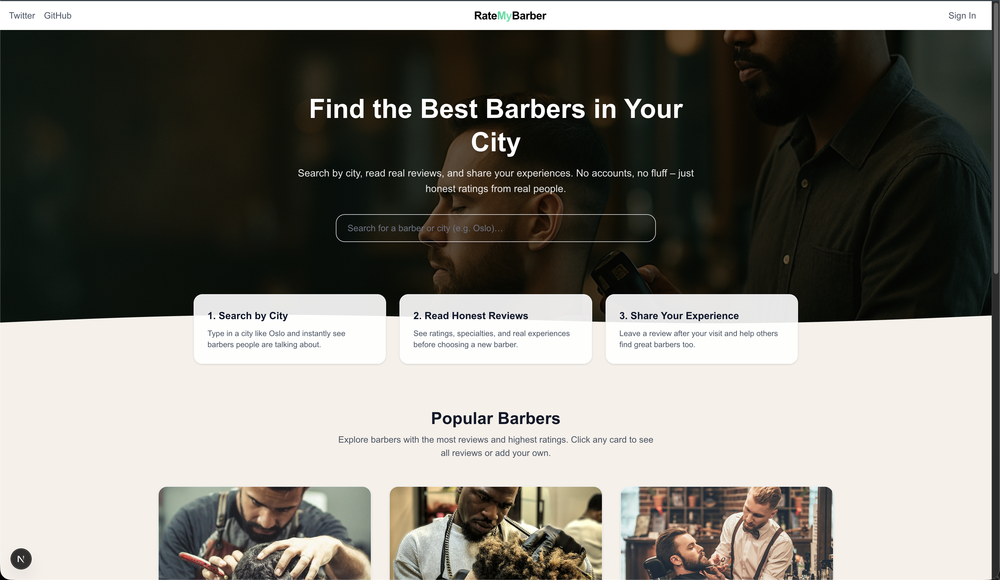
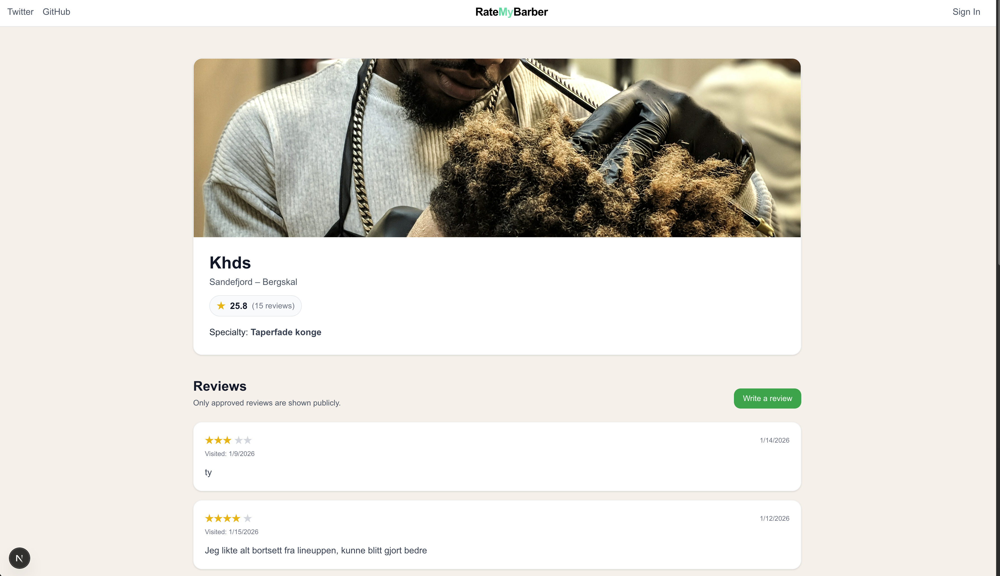
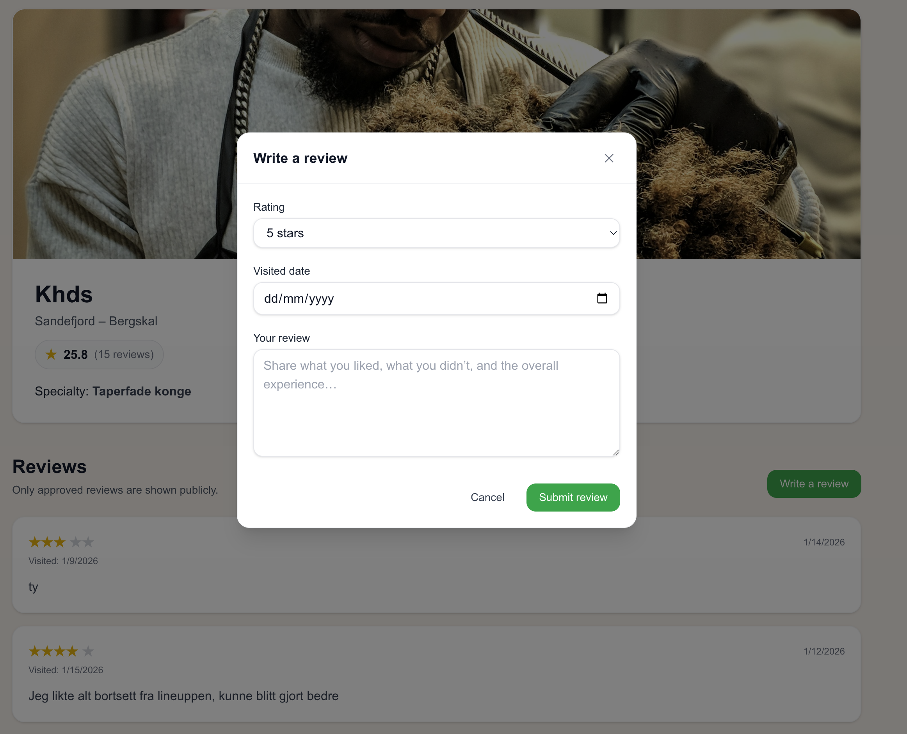

# RateMyBarber ✂️

RateMyBarber is a web application where users can discover barbers, view reviews, and share their own experiences.  
The goal of the project was to practice building a real-world, user-focused web app using modern frontend technologies.



---

## 🧠 Why I built this

I wanted to build something that feels like a real product — not just a tutorial.  
RateMyBarber helped me practice:

- Component-based UI development
- Data handling and state management
- Thinking about user experience and flows
- Structuring a scalable frontend project

---

## 🚀 Features

- Browse barbers
- View barber profiles
- Read and write reviews
- Responsive design for desktop and mobile

---

## 🛠 Tech Stack

- **Next.js**
- **TypeScript**
- **React**
- **Tailwind CSS**
- **Supabase** (database & auth) _(if applicable — remove if not used yet)_

---

## 📸 Screenshots

### Barber Profile



### Write a Review



---

## 📚 What I learned

- Building reusable React components
- Working with Next.js App Router
- Handling forms and user input
- Structuring a project for readability and growth
- Iterating based on real UI problems

---

## 🧪 Run locally

```bash
npm install
npm run dev
```
