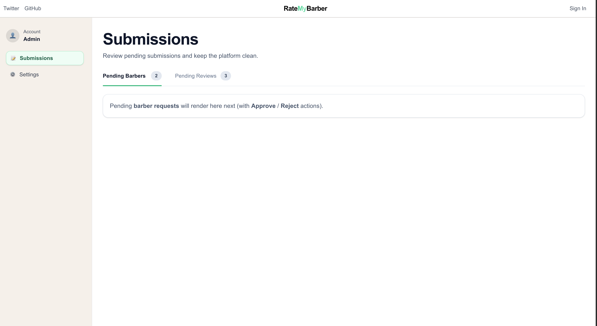

# RateMyBarber ✂️

RateMyBarber is a web app where users can discover barbers, view reviews, and share their own experiences.
I’m building this project to practice real-world product development with modern frontend tools — and to get better by shipping features consistently.



---

## 🚀 What it does (so far)

- Browse barbers and view barber profiles
- Read reviews tied to each barber
- Submit new reviews (stored in the database)
- Admin dashboard (in progress) for handling pending submissions (approve / reject)

---

## 🧠 Why I built this

I wanted a project that feels like a real product — not just a tutorial.
This app helps me improve my skills in:

- Building reusable components and clean UI
- Working with real data (CRUD)
- Designing flows that make sense for users and admins
- Iterating fast and learning by doing

---

## 🛠 Tech Stack

- **Next.js**
- **TypeScript**
- **React**
- **Tailwind CSS**
- **Supabase** (database for barbers & reviews)

---

## 🗃 Data (Supabase)

Supabase is currently used to store:

- Barbers
- Reviews

Planned next:

- Supabase Auth (login)
- Role-based access for admin dashboard (RLS policies)

---

## 🧭 Roadmap

- [x] Core UI + routing
- [x] Barbers + reviews data in Supabase
- [x] Start admin dashboard
- [ ] Add authentication (Supabase Auth)
- [ ] Secure admin actions with RLS
- [ ] Improve validation + error handling
- [ ] Add testing (basic)
- [ ] Polish UI + accessibility

---

## 📸 Screenshots

### Home / Browse


### Barber Profile


### Review Profile


### Admin Dashboard


---

## ▶️ Run locally

```bash
npm install
npm run dev
```
